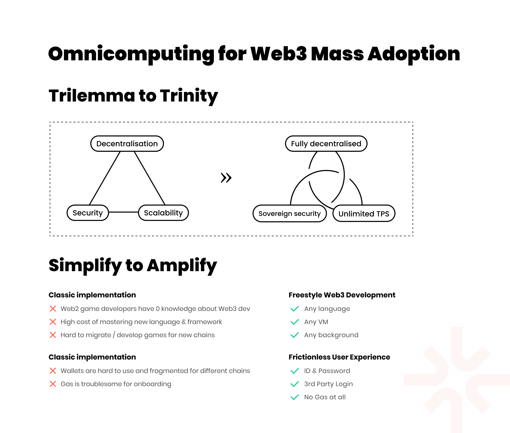
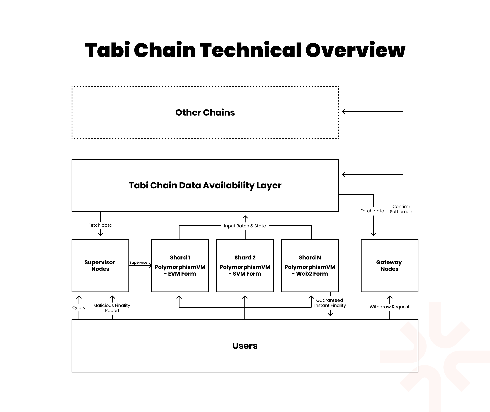
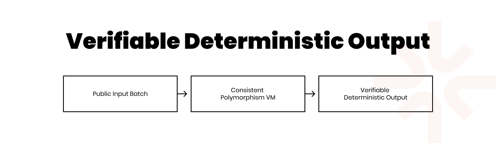
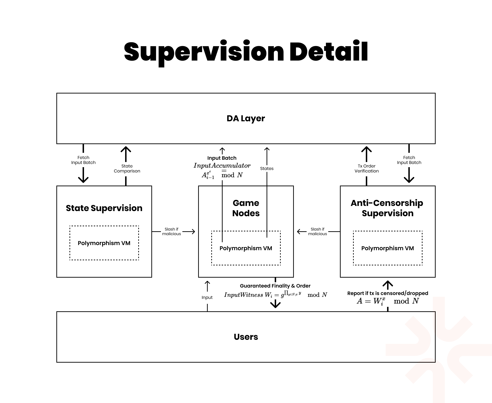
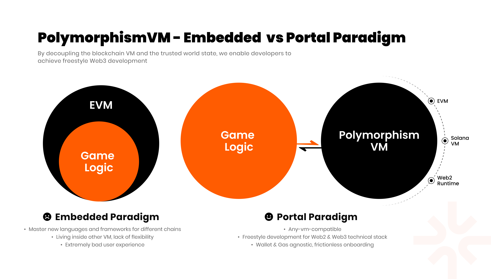
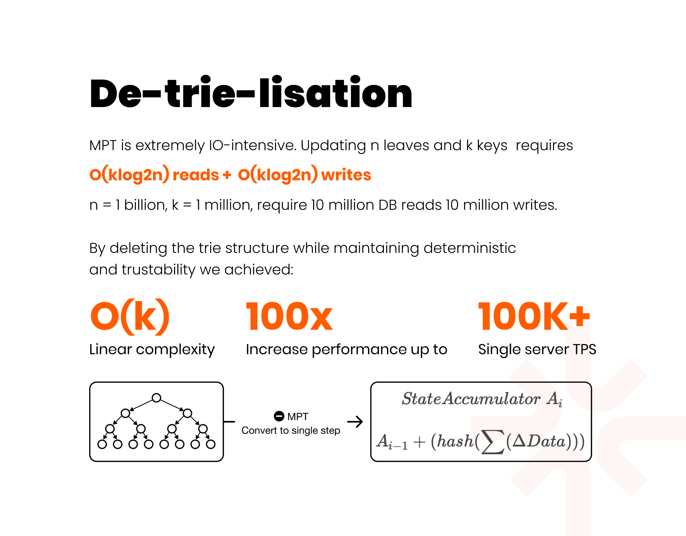

---
layout:
  title:
    visible: true
  description:
    visible: false
  tableOfContents:
    visible: true
  outline:
    visible: true
  pagination:
    visible: true
---

# Omnicomputing Preview

Tabi is a high-performance gaming blockchain based on Cosmos. With the innovative technology, **Omnicomputing**, it achieves extremely high scalability and flexibility of development:

1. Each game uses an independent high-performance shard, with the system achieving millions of TPS in total.
2. Each shard is supervised by Supervisor Nodes, including censorship resistance oversight and state correctness monitoring. Shards that do not comply will have their staked assets slashed.
3. The Polymorphism VM can encompass any classic Web3 virtual machines such as EVM and Solana VM, as well as any customised Web2 runtime. Developers and games of any type can migrate their existing games to Tabi Chain with a very simple integration (similar to using SDK), or develop new games or dApps without needing to understand the technological stacks of other chains/Web3.

Currently, Omnicomputing is still in the internal testing stage and has not been publicly tested. This document will proactively disclose its overall architecture, some implementation details, and the design rationale.

## Omnicomputing

### Problems to be Addressed

The technical and product architecture of current blockchains is a significant barrier to the mass adoption of Web3. At the infrastructure level, constrained by the blockchain trilemma, there are no adequately good technical solutions capable of handling millions of TPS, serving scenarios like gaming which require high TPS and fast finality. On the development side, developers are limited by the blockchain's technical stacks, languages, and frameworks, facing steep learning curves and costs, as well as more invisible yet crucial challenges like contract security; on the other hand, users suffer from the shackles of traditional blockchain concepts like gas, wallets, and signatures, leading to a terrible user experience.

For blockchain practitioners, these often-discussed and accustomed concepts, while necessary and reasonable, lack a clear direction on how to integrate blockchain's trustless nature with the tech stack and user experience of the traditional Web2. We've heard about some solutions attempting to address these issues atop existing blockchain architectures, but they either don't address the problems thoroughly or significantly demand developers to rely deeply on their own tech architecture. &#x20;

<figure><figcaption></figcaption></figure>

Tabi's Omnicomputing is proposed to address these core issues hindering Web3's mass adoption, with two foundational ideas:

* **Trilemma to Trinity**, breaking the blockchain trilemma and transforming it into a harmonious trinity.
* **Simplify to Amplify**, only by fundamentally simplifying the experiences of developers and users can the problems of Web3's base of developers and users be genuinely solved.

### Three Core Components

Omnicomputing consists of three core components:

* **Supervised Parallelism Sharding**. Each game operates on an independent high-performance shard, with the entire system potentially reaching millions of TPS. Each shard is monitored by Supervisor Nodes for censorship resistance and state correctness. Non-compliant shards will have their staked assets slashed. Based on Verifiable Deterministic Output, each shard compresses the original input data from users before transmitting it to the Tabi Chain's DA layer. Supervisors pull this data for validation.
* **Polymorphism VM**. The Polymorphism VM can include classic Web3 virtual machines such as the EVM and Solana VM, as well as any customised Web2 runtime. Developers and games can easily port their existing works to Tabi Chain or develop new games or dApps in their familiar tech stack without needing to understand other chains/Web3 tech stacks.
* **Gateway**. Responsible for cross-chain and cross-shard message transmission.&#x20;

<figure><figcaption></figcaption></figure>

### Network Roles

#### Supervisor Nodes

1. Pull the original input data uploaded by shards and verify the correctness of the shard's output state
2. Provide anti-censorship services to users

#### Gateway Nodes

1. Responsible for cross-chain message transmission and settlement
2. Handle cross-domain message transmission and settlement

#### Captain Nodes

1. Elect Supervisor Nodes and Gateways (gateways serve as cross-chain and cross-shard settlement nodes).
2. Randomly sample and verify the calculation results of Supervisor Nodes and Gateway Nodes to prevent collusion among Supervisors, Gateways, and Shards.
3. Counteract the extremely rare cases of collusion for censorship between Supervisors and Shards as part of anti-censorship measures.
4. Vote on the launch of games on Tabi Chain and the incentives games can receive.

## Parallelism Sharding

### Features

* Hard Instant Finality. Each Shard provides users with a receipt containing an Accumulator signed by the Shard, ensuring the order of user transactions is determined and immutable (otherwise, the shard would be slashed, and the correct transaction order would replace the shard's published batch) before being uploaded to the DA layer.
* Supervised State Transition. Supervisor Nodes monitor and verify the operations and state settlements of shards, ensuring inputs and outputs are correct.
* Any-vm-compatible. Through the Polymorphism VM, each shard can customise different VMs or runtimes and various combinations according to its specific needs. Later sections will detail the Polymorphism VM.

### Supervision Mechanism

The foundational idea of Parallelism Sharding, maintaining trustlessness and verifiability, is that as long as there is a deterministic input and state transition function, the final output state will be consistent.&#x20;

<figure><figcaption></figcaption></figure>

&#x20;In Tabi Chain, each shard compresses and uploads the original input data from users to Tabi Chain's DA layer. This ensures that the original input data for each shard is fixed, and since Supervisors include the same Polymorphism VM as each shard, everyone's state transition function or runtime is also consistent. Each shard will also attach the state transition result of each original input batch, allowing Supervisor Nodes and Gateway Nodes to verify the output provided.

If the output provided by a shard does not match the result obtained by a Supervisor, the Supervisor will initiate a slash motion. If over 2/3 of the network's Supervisors reach consensus, the shard's staked assets will be slashed, and the incorrect result will be replaced with the correct one.

The process of submitting original data batches to the DA layer is very similar to Rollup, but the final state verification method is quite different.

Tabi Chain uses network consensus to perform computations and comparisons directly, ensuring the results are correct. We will discuss the comparison with Rollup and the design philosophy in later sections.

### Anti-censorship

The transaction receipt given to users by a shard includes an Accumulator signed by the shard. It must verify the correct order of user transactions but does not necessarily have to verify the inclusion of the user's transaction in that Accumulator, i.e., not deal with the set membership problem, because every transaction in the batch is public and will be executed in order by the Supervisor.

Therefore, using a Hash Accumulator is a simple, low-computation, and fitting solution.

For example:

1. The current accumulator is `A`.
2. The user input command is `i`, and the new accumulator `A_1 = hash(A+i)`.
3. After signing `A_1`, it is sent to the user.
4. `i` and `A_1` are packaged together into the input batch on-chain (each transaction and its corresponding accumulator are published).
5. The user can compare the signed `A_1` with the on-chain batch information.
6. Check if `A1` appears on-chain, if not, directly report to the super nodes.
7. Another scenario, `A1` is on-chain, but the bundled transaction is not placed in the correct position. In this case, there's no need for user reports; super nodes can identify this issue on their own.

Why can't we simply use a transaction id (incremental natural number)? For the aforementioned seventh point, natural numbers cannot falsify the transaction order without user reports, supervisors cannot verify directly based on that data.

Why not only upload the last accumulator value of each batch but require each transaction to correspond? For Supervisor Nodes, whether each transaction has a corresponding accumulator value is irrelevant, theoretically, only the final or total accumulator value of each batch is needed. Including an accumulator for each transaction facilitates user or Captain Node data checking, though it marginally increases data volume.

<figure><figcaption></figcaption></figure>

&#x20;However, this still does not constitute a complete anti-censorship system because, aside from tampering with the transaction order, a shard might also completely ignore the user's transaction request. A request not being packaged means there are no traces in the DA layer, naturally meaning no anti-censorship.

Therefore, Supervisor Nodes must have the authority to submit original transaction inputs on the DA layer. If users face non-responsive shards, they can submit the transaction to Supervisors. This method will not directly lead to the shard being slashed, as it might be susceptible to abuse. However, the shard must respond to the transaction submitted by the Supervisor and provide the correct ordering, otherwise, it will be slashed. Here, there is a moderate response period for the shard to incorporate the transaction into its batch, without requiring an immediate response from the shard, which could lead to computational rollback within the shard server, disrupting its operations.

Of course, there might be scenarios where an individual Supervisor goes down or colludes with a shard to censor, but users need only submit their request to other Supervisors.

So, is the anti-censorship system complete with this? Not yet, as there is a very rare scenario where all Supervisor Nodes conspire with the shard. Although unlikely because Supervisor Nodes typically number in the dozens, Tabi, as a complete public chain system, must consider this scenario.

This is where Captain Nodes play their anti-censorship role: users submit transactions to Captain Nodes. Captain Nodes first send a **hash commitment** of the transaction to the chain. This way, aside from the censored user and the chosen Captain Node, no one knows the specific content of the transaction; hence, **it cannot be censored**. They can then reveal the transaction, and the shard must package the transaction within a reasonable response period. With tens of thousands of Captain Nodes, as in other blockchain systems, there is no possibility of collective censorship in this scenario.

### Hard Instant Finality

Through the mechanisms mentioned above, we achieve not only anti-censorship but true Hard Instant Finality.

In Rollup and similar schemes, the concept of Instant Finality exists. Users wait only for communication with the server and the server's sorting time, generally a negligible few tens of milliseconds, almost equivalent to instant. However, in the Rollup ecosystem, Instant Finality is soft, as transactions can be tampered with or completely discarded before uploading to the DA layer. This has occurred in some well-known Rollups.

In Omnicomputing, due to the presence of economic deterrence, it is difficult for shards to act maliciously. Or rather, even if a shard, regardless of cost, wishes to censor a particular user, it is pointless because shards are also monitored by Captain Nodes and can be replaced by any other service provider at any time. Since all historical transactions are stored in the DA layer, other newly elected shard servers can easily reconstruct the entire shard's state.

Although affected by censorship and requiring additional anti-censorship steps will lose the "Instant" characteristic, the finality is still guaranteed. Moreover, censorship is not a common scenario. Therefore, this type of Instant Finality can be considered hard and immutable. For both financial applications and gaming applications, **Hard Instant Finality** is a highly coveted feature in all blockchain technology solutions.

### Data Availability Layer Optimisation

Due to the parallel nature of shards, data across different shards need not consider linear ordering. DAG will enhance the speed of data propagation.

Moreover, Tabi will adopt technology similar to Ethereum's Data Blob, completely separating data from the execution layer VMs to achieve better economy and efficiency.

Full details of DA Optimisation will be disclosed later.

### Inter-shard Transactions

Clearly, whether running games or other types of applications in various Shards, inter-shard interconnectivity is indispensable. This part will be elaborated on in the Gateways section.

## Polymorphism VM

### Embedded Paradigm VS Portal Paradigm

<figure><figcaption></figcaption></figure>

&#x20;In blockchain systems with VMs, VMs are unique and exclusive. The lifecycle and operations of all smart contracts or programs are governed by the specific VM, which presents numerous issues:

1. Developers need to learn new languages and technical frameworks to develop on the required blockchain. This is especially costly for developers entirely new to Web3 development.
2. Even if some learning processes seem relatively simple, mastering a series of underlying concepts like contract security is very challenging.
3. The portability of applications and games is poor. For example, games developed for Solana that wish to be ported to Ethereum would essentially need to be rewritten from scratch.
4. Scaling solutions are also constrained by the main chain's VM.
5. The forms of user interaction and the concepts users need to understand are also deeply tied to the chain and VM mechanisms. Although we have seen solutions like EIP-4337 attempting to optimise these issues, they haven't solved the problems fundamentally, and different solutions introduce their new workflows and concepts to developers or users.
6. Most blockchain VMs, due to the need for verifiability and trustlessness, use some inefficient data structures and operations.

Omnicomputing innovatively proposes the **Portal Paradigm** as an alternative to the traditional **Embedded Paradigm**, where programs no longer live within the host runtime, but relate to it through simple invocation. Its specific implementation is the Polymorphism VM, which, as the name suggests, is polymorphic and changeable.

The design rationale for Polymorphism VM is:

1. Modularity. The Polymorphism VM should not be an indivisible singleton. It should be clearly divided into three parts: the DA layer interaction module, the computation module, and the interaction interface, and should meet the computational needs of platforms other than Tabi Chain, serving a broader range of Web3 scenarios.
2. Flexibility. The Polymorphism VM should meet the various needs of Web2 and Web3 developers. For instance, a game from another blockchain moving to Tabi should find a corresponding VM within Polymorphism VM, or developers should have a simple way to mount it if not available; newcomers to the blockchain industry from the Web2 sphere shouldn't need to learn all the various blockchain VMs, but rather directly communicate with the Polymorphism VM using their familiar language.
3. Composability and Customisability. The Polymorphism VM should also support running multiple different VMs under the same Shard.
4. Efficiency. For Web2 development, there should be a distinct runtime from Web3 virtual machines, liberating developers and users. Additionally, some of the data structures and operational processes common to Web3 VMs should be optimised after thorough investigation, even if they are quite common.

### Freestyle Development

If developers from any background can pick their desired development environment, toolchain, language, framework, virtual machine, runtime, etc., to seamlessly migrate existing projects or create new blockchain projects, we call it Freestyle Development.

For example, CryptoKitties on Ethereum, Panzerdogs on Solana, and Sui 8192 on Sui, despite being developed in different languages and frameworks and operating in totally different environments, can all be ported to Tabi Chain at low cost and seamlessly.

Similarly, a traditional Web2 developer with no understanding of Web3 doesn't need to worry about the complex details and principles of blockchain technology. They can simply interact with the Polymorphism VM as easily as using a straightforward SDK, utilising their existing development frameworks and languages to publish their works on Tabi Chain.

Omnicomputing's technical architecture grants Web3 an entirely new development model — Freestyle Development, laying a solid foundation for Web3 mass adoption.

### Gas-agnostic & Credential-agnostic

Freestyle Development is aimed at developers, but for ordinary users, thanks to the high degree of freedom on the developer side, users naturally also enjoy a Frictionless User Experience. In the blockchain world, wallets (private keys) and the concept of gas are the most criticised by users. In the traditional internet, users do not need to know about these concepts, nor do they need to bear the extra usage costs associated with them. The feature where users don't have to worry about gas and credentials (login, private keys, signatures, and other authentication actions) is called Gas-agnostic and Credential-agnostic, collectively referred to as **Frictionless User Experience**.

For example, regarding login and authentication, developers can directly employ traditional ID-password or third-party login mechanisms for blockchain applications. As for gas, developers may choose whether their game requires gas or opt for traditional gas models.

The concept of gas is straightforward to understand, but credentials require further discussion. While Web2's account systems can provide a good user experience, using them as is seems problematic because Tabi and its Omnicomputing architecture are also open and transparent. Directly using the user-to-server interaction model would cause severe security issues, making the entire system utterly insecure.

The difference between the ID-password model and the public-private key pair stems from symmetric versus asymmetric cryptography. In a server-user architecture, both sides hold the same secret. In a blockchain-user architecture, only the user possesses the secret. Although Omnicomputing's shard might not be a blockchain, all data need to synchronise to the public DA layer, so the login and operation verification methods used must be asymmetric. However, since we don't want users to manage private keys or use wallets, affecting wide adoption due to cumbersome actions and poor experience, applications built on Omnicomputing using traditional ID-password or OAuth third-party authentication login are highly desirable. How can we combine the two?

Developers could opt for a relatively simple centralised method to map IDs to public-private key pairs, suitable for applications with less stringent asset security. For apps and games that require decentralisation and trustlessness to some extent, either storing private keys in more trusted storage facilities (e.g., WebAuthn standard, Apple KeyChain, etc.) or using cryptographic methods like zero-knowledge proofs could be combined. If the app aims to achieve full, hardcore decentralisation (like a whale using a cold wallet), users might still need to memorise and manage private keys, an unavoidable burden. However, most gaming applications don't require this.

Thus, for most situations, especially in games, Omnicomputing fundamentally solves the user experience issue in Web3. We've seen attempts like EIP-4337 or session keys trying to optimise some user experiences, but they're just countless patches struck on the old system to solve a few critical issues, carrying **heavy historical baggage**. More importantly, **each of these solutions has its own technical stack and standards, necessitating developers to adapt to these standards**. In Omnicomputing, however, each game and application can set their account and gas standards according to their preferences **without understanding, mastering, or adapting to any third-party solutions**.

### Mounting Different Blockchain Virtual Machines

Currently, the Polymorphism VM has already adapted to EVM, allowing developers from the EVM ecosystem to seamlessly transfer their projects to Tabi. Other blockchain VMs like Solana VM are being actively adapted, and fully Web2-oriented runtimes are under development.

More implementation details and considerations for this section will be disclosed later, but for now, developers can treat it as a regular EVM use.

### Runtime for Web2 Developers

The Web2 Runtime includes the following modules and concepts:

* **State DB**, used to save runtime data
* **Account Helper**, responsible for mapping symmetric ID systems to asymmetric cryptography systems
* **Instruction Processing Bus**, responsible for all transaction processing, state transitions, etc.
* **Submitter**, submits original inputs to the DA layer

Other modules are relatively straightforward and will be detailed later. Let's focus on introducing the Instruction Processing Bus module for now.

**Instruction Processing Bus**

**Instruction** Can be thought of as a transaction, most of which will cause **State Transition** within the Runtime. We avoid the term "transaction" partly to distinguish it from traditional blockchain technology stacks and to differentiate it from transactions at the DA layer.

Instructions can further be divided into `admin instructions` and `user instructions`. The term "admin" doesn't necessarily imply a centralised entity with complete control over the shard, but can also be a decentralised network setup or integrated into the shard through preset or Governance processes. Distinguishing these types of instructions is crucial because the results of certain external API inputs and random numbers may differ on subsequent calls from the first. For example, an API of a game server might return different results based on time and other parameters. This makes state verification by Supervisors impossible. Therefore, all random or external inputs must be immediately determined upon entering the `Instruction Processing Bus`, i.e., the system's inputs must not contain randomness upon entry, although randomness and arbitrariness are allowed at the request stage. This design is somewhat similar to an oracle but offers higher flexibility and usability because whether to call external requests is entirely dependent on the developers' simple implementation, and entry storage is managed by the `Instruction Processing Bus`.

The data structure of an Instruction includes three parts: the signature, function pointer, and parameters. To make development clearer, Protobuf encoding will be used.

**Instruction Accumulator** Represents the collection of all Instructions in a batch. Each sorted instruction triggers an update to the accumulator value.

Used for anti-censorship and anti-fork attacks, with specific implementation details as follows:

1. The current accumulator is `A`.
2. The user's input instruction is `i`, and the new accumulator `A_1 = hash(A+i)`.
3. After signing `A_1`, it is sent to the user.
4. `i` and `A_1` are packaged together into the input batch on-chain (each transaction and its corresponding accumulator are published).
5. The user can compare the signed `A_1` with the on-chain batch information.
6. Check if `A1` has appeared on the chain; if not, directly report to the super nodes.
7. The second scenario is where `A1` is on-chain, but the bound transaction is not in the correct position. There is no need for user reports in this case, as the super nodes will automatically detect it.

**Instruction Queue** The default sorting within the instruction queue is based on the sequence of instructions received. Developers can modify this module if they have special requirements.

**State Read/Write Functions** Functions for reading and writing the state, fixed and immutable within the Web2 Runtime (developers have no need and means to modify them). Responsible for reading or writing to the runtime DB.

**State Transition Functions (STF)** STFs lead to changes in the runtime's state, i.e., changes or updates in the values stored in the State DB. They possess the following properties:

* STFs must declare the variable to be modified and its new value.
* STFs can be placed anywhere within the program or game code, maintaining a simple interface relationship with the runtime, thus having a low level of coupling.
* Developers are not required to write how to modify the DB; this part is managed by state read/write functions.

**De-trie-lisation & State Accumulator** In this section, let's discuss in detail how to represent the overall state of the State DB. In traditional blockchain practices, stateful VMs generally use a Merkle tree root to represent the world state. This method is reasonable, with most blockchain solutions employing it, because Merkle trees can be used to query whether a transaction is part of a block.

However, Merkle trees also have the following problems:

1. In practice, most nodes won't save the Merkle trees of all blocks, hence cannot provide a path for a transaction from earlier blocks.
2. Blocks cannot prove a direct relationship between two roots merely through Merkle trees.
3. Users rarely use Merkle trees for verification; infrastructures like cross-chain bridges may use them, but alternatives like zero-knowledge proofs are also viable.
4. Requesting a balance, tree root, and path from a node implies distrust in that node; however, the root and path also come from that node, so the logic seems circular and not entirely trustless.
5. Merkle trees have extremely low I/O efficiency, requiring `O(klog2n) reads + O(klog2n) writes`.

From the issues mentioned above, the advantage of using a Merkle tree's root to represent the total state has significant flaws, making it not as useful in practice as it is in theory. Therefore, for high-performance gaming scenarios, we need to consider a new method for representing the total state of the State DB. Hence, its design rationale should be:

1. Capable of representing the total state of the entire database, computations must be lightweight, and not cumbersome like Merkle trees.
2. Ideally, it should be able to verify set membership (like Merkle trees), but if this becomes too complex in practice, it could be omitted, as it's not a frequent requirement for users. For infrastructure, this could be simply based on the principle of Verifiable Deterministic Output to verify transactions.
3. Still ensures trustlessness, the core principle remains Verifiable Deterministic Output.

We know that Merkle trees and number-theoretic accumulators are two cryptographic schemes that can verify set membership. However, number-theoretic accumulators have severe practical issues, like RSA accumulators needing to iterate over all elements except the target element to generate a witness, severely impacting usability. Furthermore, the generation and storage of P and Q are also problematic.

Therefore, we could use a simple Hash Accumulator to represent the total state `StateAccumulator A_i = A_i-1 + (hash(∑(△Data))`. &#x20;

<figure><figcaption></figcaption></figure>

This approach has other benefits:

1. No need to instantiate a Merkle tree in memory.
2. No need for caching Merkle trees for memory optimisation.
3. When updating information, there's no need to modify Merkle tree nodes level by level before storage; only the accumulator information needs updating, changing the complexity from logarithmic to linear O, and the improvement in I/O efficiency varies with the number and levels of the trees, roughly between tens to hundreds of times.
4. Since Merkle trees are removed, there's no need to use KVDB, granting developers freedom to choose the type of DB. We call this De-KV-lisation.

## Gateways

Gateway Nodes are responsible for cross-shard and cross-chain settlements, collectively referred to as cross-domain settlement.

Like Captain Nodes and Supervisor Nodes, Gateway Nodes are part of the overall network consensus. They are elected by Captain Nodes and have the same verification capabilities as Supervisor Nodes, but lack the ability to slash incorrect states and anti-censorship features; however, they possess the ability for cross-domain settlement. These nodes are also subject to random inspections by Captain Nodes.

The purpose of this design is to decentralise the power of Supervisors and Gateways, making the network more decentralised. &#x20;

<figure><figcaption></figcaption></figure>

Gateway Nodes are essential for several reasons:

1. Inter-shard and inter-chain, as well as inter-shard-chain messaging, are indispensable.
2. For cross-domain transactions involving shards, the specific forms and execution environments of the Polymorphism VM used by different shards will differ. It is challenging for third-party bridges to handle these non-standard scenarios.
3. The security of Gateway Nodes is higher than that of third-party cross-chain bridges (unless the bridge’s witnesses are also based on public blockchain consensus), as attacking Gateway Nodes is tantamount to attacking a public blockchain.

## Summary

Omnicomputing is still in the intense phase of internal R\&D and testing, and this document will be gradually updated with more details as the development progresses. For gaming scenarios, we will also offer more convenient and effective services based on Omnicomputing, such as Unity SDK, etc.

Tabi Chain's Omnicomputing is an innovative, high-performance, trustless new-generation blockchain technology solution. Its core components include Parallelism Sharding, Polymorphism VM, and Gateway. This technology solution introduces concepts like Freestyle Development and Frictionless User Experience, greatly liberating developers and users and laying a solid foundation for Web3 mass adoption.
