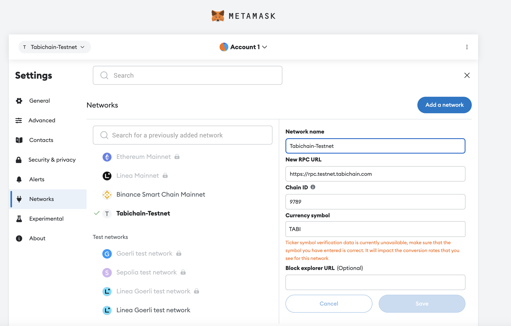

# Smart-Contract

## EVM Smart Contract

Since the introduction of Ethereum in 2015, the ability to control digital assets through smart contracts has attracted a large community of developers to build decentralized applications on the Ethereum Virtual Machine.

Whether you are building new use cases on Tabichain or porting an existing dApp from another EVM-based chain (e.g. Ethereum, Evmos), you can easily build and deploy EVM smart contracts on Tabichain to implement the core business logic of your dApp. Tabichain is fully compatible with the EVM, so it allows you to use the same tools (Solidity, Remix, etc.) and APIs (i.e. Ethereum JSON-RPC) that are available on the EVM.

Leveraging the interoperability of Cosmos chains, Tabichain enables you to build scalable cross-chain applications within a familiar EVM environment. Learn about the essential components when building and deploying EVM smart contracts on Tabichain below.

### Build Smart Contract with Solidity

You can develop EVM smart contracts on Tabichain using [Solidity](https://docs.soliditylang.org/en/latest/), which is also used on Ethereum. If you have deployed smart contracts on Ethereum or any other EVM-compatible chain, you can use the same contracts on Tabichain.

Since it is the most widely used smart contract programming language in Blockchain, Solidity comes with well-documented and rich language support.

### Prepare Account for EVM

You might already have an EVM account and hold its mnemonic phrase, but in Tabichain, EVM accounts are displayed with the `tabi` prefix.

### Deploy Smart Contract with Remix

**Remix** is an in-browser IDE for Solidity smart contracts. In this guide, we will learn how to deploy a contract to a running Ethermint network through Remix and interact with it.

#### Add Network with Metamask

Before we use Remix to develop and deploy smart contracts, we could first add a custom network for Tabichain with [Metamask](https://metamask.io/).

Open the Metamask extension on your browser, you may have to log in to your Metamask account if you are not already.

Then click the top right circle and go to `Settings > Networks`. Press the `Add Network` button and fill the form as the example below with your application ChainID:

* Network Name: Tabichain 1.0
* RPC URL: [https://rpc.testnet.tabichain.com](https://rpc.testnet.tabichain.com)
* ChainID: 9789
* Symbol: TABI

<figure><figcaption></figcaption></figure>

#### Connect TabiChain-TestNet account to Remix

**Note: You may need to go to the** [**faucet**](faucet.md) **to obtain some test tokens first**

Start your TabiChain daemon and rest server, or just connect to the remote server, based on your network configuration.

Once that is complete, go to [Remix](http://remix.ethereum.org/). There are some contracts in the **File Explorer**. Select any of these contracts. On the left-most bar, select the **Solidity compiler** and compile the contract.

Next, select the **Deploy and run transaction**. Note you should change the environment to **Injected Provider**. This will open a Metamask popup for you to confirm connecting your Metamask to Remix.

#### Deploy and Interact

Now that your account is connected, you are able to deploy the contract. Press the Deploy button. A metamask pop-up will appear asking you to confirm. Confirm the transaction.

Once the contract has been successfully deployed, you will see it show up in the **Deployed Contracts** section in the left-hand side, as well as a green check in the Remix console showing the transaction details.

**Note: Solidity version must be <= 0.8.19.**

<figure><figcaption></figcaption></figure>
